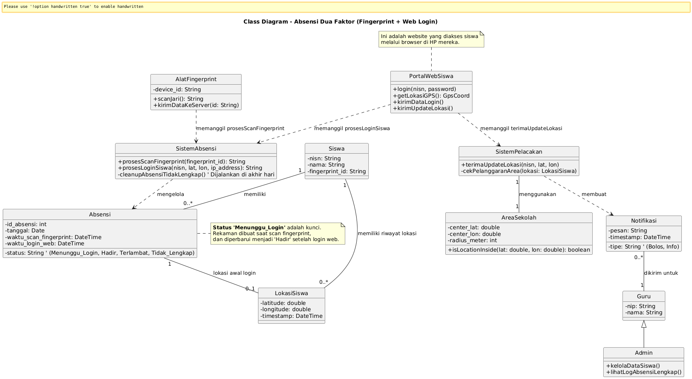
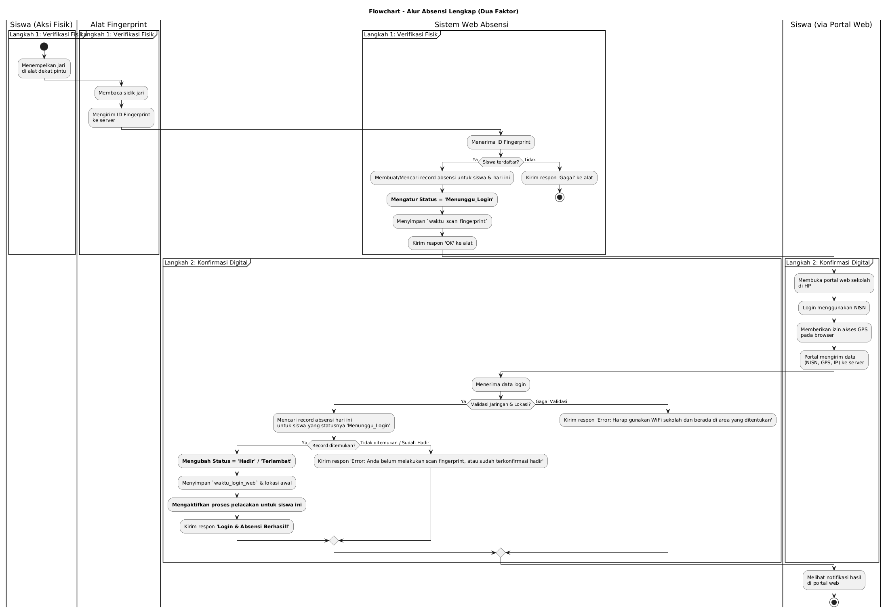

<p align="center">
  <b>Dashboard Digital untuk Santri Modern</b><br/>
  Sistem Absensi & Pelacakan Siswa yang <b>Modern</b>, <b>Akurat</b>, dan <b>Anti-Titip Absen</b>.
</p>


---
# PortalSantriCerdas Web Application

## 🎯 1. Tujuan & Deskripsi Proyek

**Portal Santri Cerdas** dirancang untuk menggantikan metode absensi manual dengan sistem **verifikasi ganda (two-factor)** yang canggih, memastikan setiap catatan kehadiran valid dan akuntabel.

1.  **👆 Verifikasi Fisik (Bukti Kehadiran):** Siswa menempelkan sidik jari pada alat pemindai yang terpasang di dekat pintu kelas. Ini adalah langkah pertama yang membuktikan kehadiran fisik siswa di lokasi.
2.  **📱 Konfirmasi Digital (Aktivasi Sesi):** Setelah pemindaian, siswa wajib login ke **Portal Web Sekolah** melalui perangkat mereka. Login ini akan mengonfirmasi identitas siswa dan secara otomatis mengaktifkan pelacakan GPS selama jam sekolah.

> **Aturan Emas:** Kehadiran seorang siswa dianggap **SAH** hanya jika **kedua langkah** di atas berhasil dilakukan. Jika salah satu gagal, status kehadiran akan ditandai **tidak lengkap**.

---

## ✨ 2. Fitur Utama Sistem

* ✅ **Verifikasi Absensi Dua Faktor** (Fingerprint + Login Web)
* ✅ **Pelacakan GPS Real-time** selama jam sekolah untuk keamanan
* ✅ **Geofencing** untuk memastikan siswa berada di dalam area sekolah
* ✅ **Dashboard Siswa & Guru** berbasis web yang interaktif
* ✅ **Notifikasi Otomatis** untuk status absensi terlambat atau tidak lengkap
* ✅ **Manajemen Data Master** untuk mengelola data siswa, guru, dan kelas
* ✅ **Laporan Kehadiran** yang dapat diekspor (harian, mingguan, bulanan)

---

## 🛠️ 3. Arsitektur & Alur Kerja

Sistem ini terdiri dari tiga komponen utama yang saling berinteraksi:


1.  **📟 Alat Fingerprint (Perangkat Keras)**
    * **Tugas:** Membaca sidik jari dan mengirimkan ID unik ke Backend.
    * **Lokasi:** Terpasang di dinding pintu kelas.
    * **Aksi:** Menggunakan `HTTP POST` ke API Laravel.

2.  **🧠 Backend (Laravel)**
    * **Tugas:** Otak dari sistem. Menerima data, memvalidasi, menyimpan ke database, dan mengelola semua logika bisnis.
    * **Aksi:** Menyediakan API, mengelola database, memeriksa geofencing, dan mengirim notifikasi.

3.  **🖥️ Frontend (React + Tailwind CSS)**
    * **Tugas:** Antarmuka yang dilihat dan digunakan oleh siswa dan guru.
    * **Aksi:** Menampilkan form login, dashboard, status absensi, dan berinteraksi dengan Backend untuk mengambil & mengirim data.
## ClassDiagram & Flowchart 

### 1. Class Diagram


### 2. Flowchart



---

## 📦 4. Panduan Instalasi

### A. Prasyarat
Pastikan perangkat lunak berikut sudah terinstal di komputer Anda:
* PHP `^8.1`
* Composer
* Node.js `^18`
* NPM
* MySQL atau MariaDB
* Git

### B. Langkah 1: Clone Proyek & Siapkan Database
1.  **Clone repositori:**
    ```bash
    git clone [https://github.com/awanmh/PortalSantriCerdas.git](https://github.com/awanmh/PortalSantriCerdas.git)
    cd PortalSantriCerdas
    ```
2.  **Buat database kosong** dengan nama `absensi_smk` (bisa melalui phpMyAdmin, HeidiSQL, atau CLI).

### C. Langkah 2: Setup Backend (Laravel)
1.  **Install dependensi PHP:**
    ```bash
    composer install
    ```
2.  **Konfigurasi file `.env`:**
    ```bash
    cp .env.example .env
    ```
    Buka file `.env` dan sesuaikan bagian database:
    ```env
    DB_CONNECTION=mysql
    DB_HOST=127.0.0.1
    DB_PORT=3306
    DB_DATABASE=absensi_smk
    DB_USERNAME=root
    DB_PASSWORD=
    ```
3.  **Generate kunci aplikasi:**
    ```bash
    php artisan key:generate
    ```
4.  **Jalankan migrasi database:**
    ```bash
    php artisan migrate
    ```

### D. Langkah 3: Setup Frontend (React)
1.  **Install dependensi JavaScript:**
    ```bash
    npm install
    ```
2.  **Konfigurasi file `.env` Frontend:**
    Buka kembali file `.env` di root proyek dan tambahkan baris berikut di bagian bawah:
    ```env
    VITE_API_BASE_URL=[http://127.0.0.1:8000/api](http://127.0.0.1:8000/api)
    ```

### E. Langkah 4: Menjalankan Aplikasi
Buka **dua terminal** terpisah di direktori proyek:

* **Terminal 1 (Jalankan Backend):**
    ```bash
    php artisan serve
    ```
    > 🟢 **Backend berjalan di:** `http://127.0.0.1:8000`

* **Terminal 2 (Jalankan Frontend):**
    ```bash
    npm run dev
    ```
    > 🔵 **Frontend dapat diakses di:** `http://localhost:5173`

### F. Langkah 5: Konfigurasi Alat Fingerprint
1.  **Endpoint API:**
    Arahkan perangkat untuk mengirim `HTTP POST` ke alamat berikut. Ganti `[IP_KOMPUTER_ANDA]` dengan alamat IP lokal dari komputer yang menjalankan server Backend.
    ```
    http://[IP_KOMPUTER_ANDA]:8000/api/absensi/fingerprint
    ```

2.  **Format Data (JSON):**
    Pastikan format data yang dikirim adalah JSON seperti ini:
    ```json
    {
      "fingerprint_id": "ID_UNIK_DARI_HASIL_SCAN"
    }
    ```
---

<p align="center">
  🚀 <b>Portal Santri Cerdas</b> — Membawa disiplin dan transparansi ke dunia pendidikan pesantren modern.
</p>
