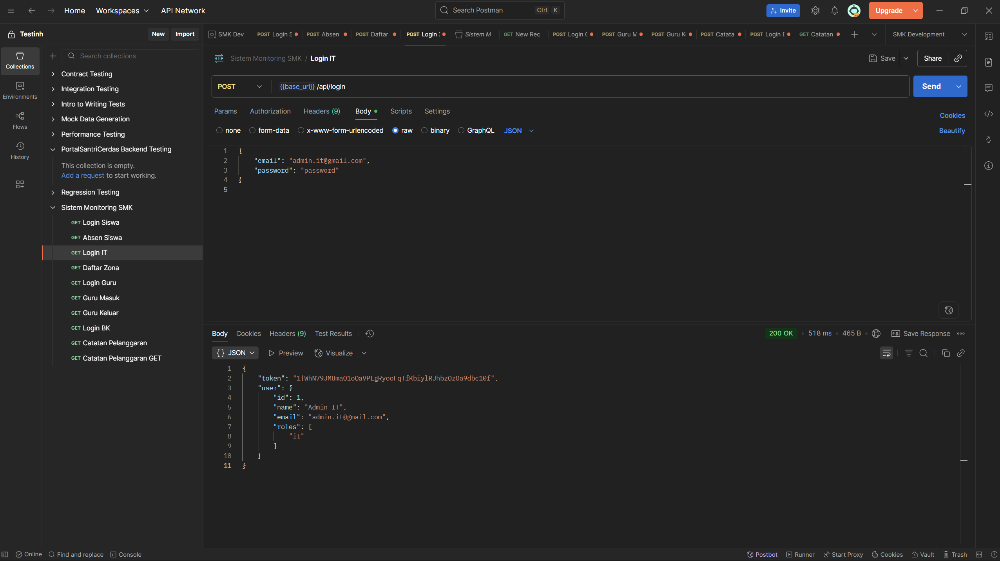
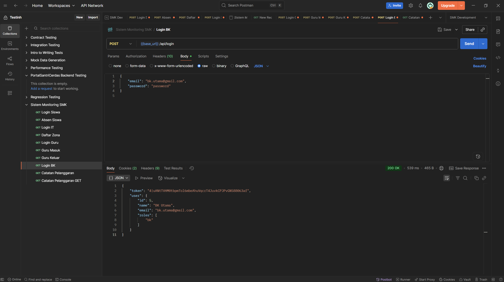
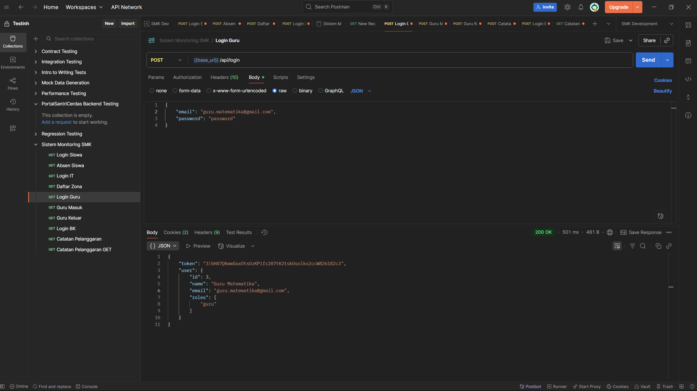
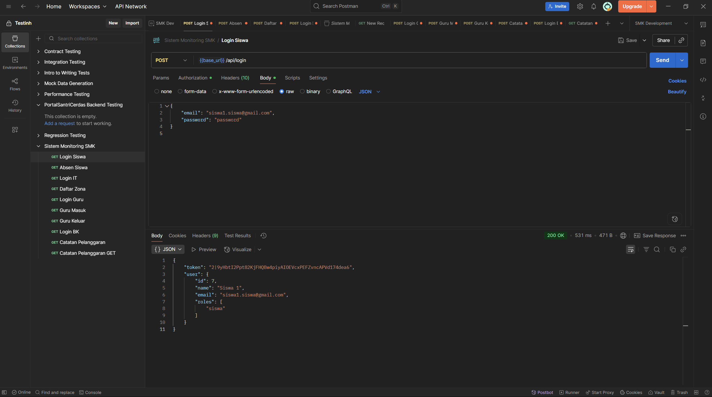
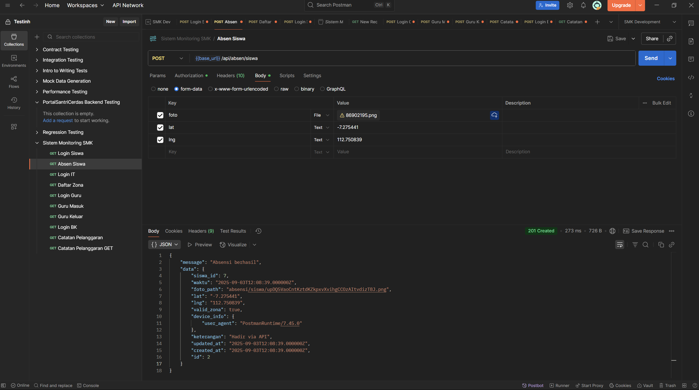
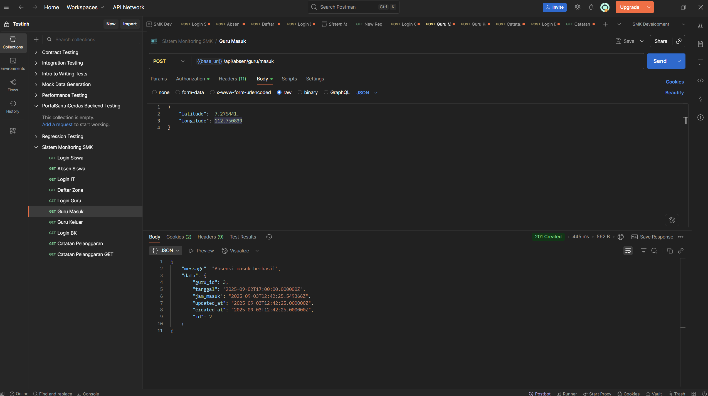
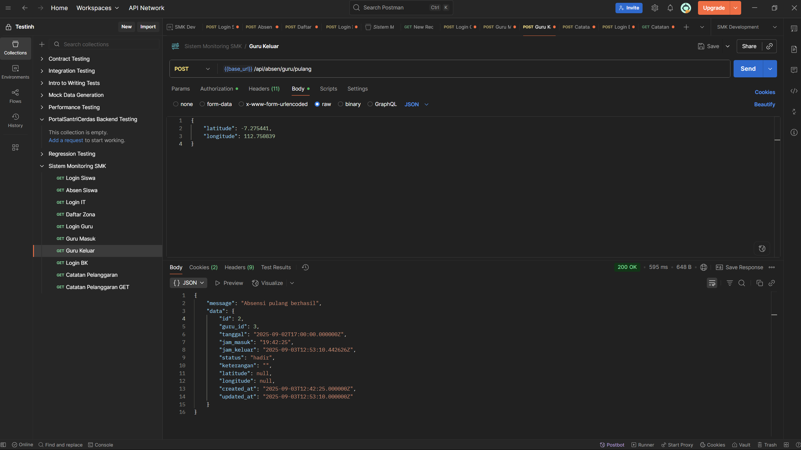
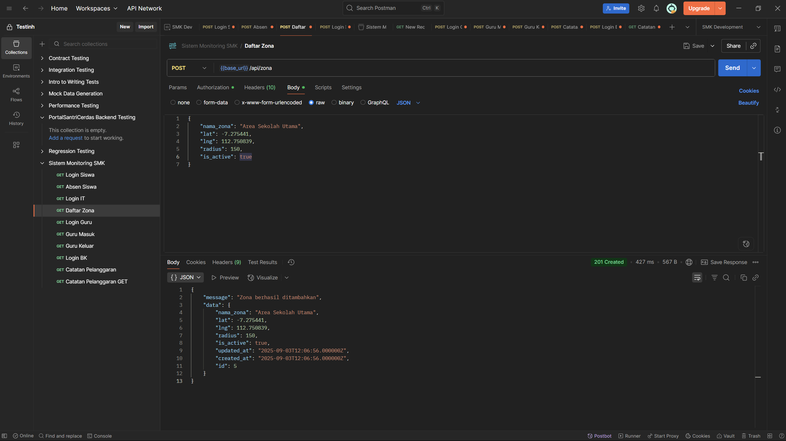
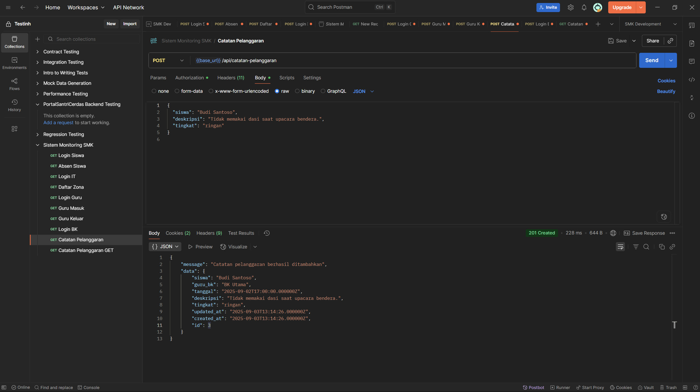
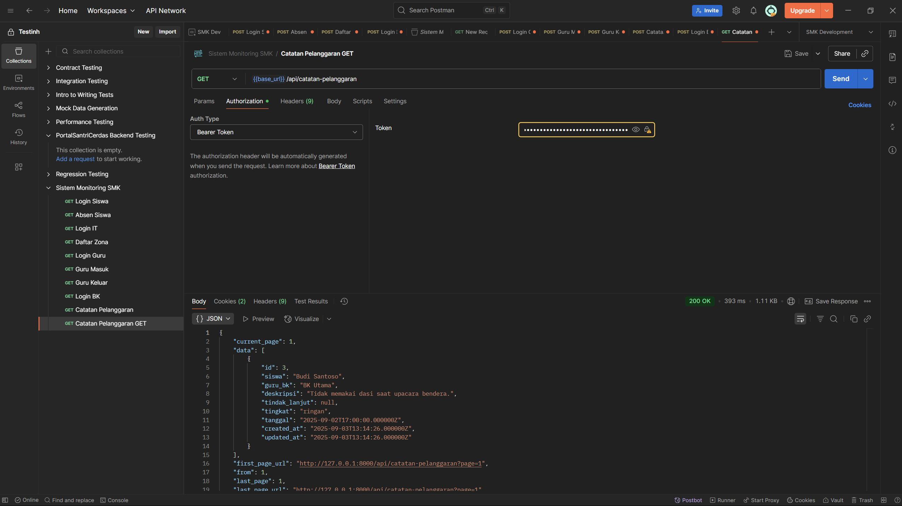

#### 📡 **Progress Endpoint API Penting**

| Endpoint | Method | Deskripsi | Middleware | Status |
|----------|--------|-----------|------------|--------|
| `/api/login` | POST | Login user | - | 200 OK|
| `/api/absen/siswa` | POST | Absensi siswa | `auth:sanctum, role:siswa` | 200 OK|
| `/api/absen/guru/masuk` | POST | Absensi masuk guru | `auth:sanctum, role:guru` | 200 OK|
| `/api/absen/guru/pulang` | POST | Absensi pulang guru | `auth:sanctum, role:guru` | 200 OK|
| `/api/zona` | GET/POST/PUT/DELETE | Manajemen zona | `auth:sanctum, role:it` | 200 OK |
| `/api/catatan-pelanggaran` | GET/POST/PUT/DELETE | Catatan pelanggaran | `auth:sanctum, role:guru,bk` | 200 OK|
| `/api/export/absensi/siswa` | GET | Export absensi siswa | `auth:sanctum, role:it,guru,bk` | 200 OK |

### 1. Login

### 2. Absen Siswa

### 3. Guru Masuk

### 4. Guru Pulang

### 5. Zona

Belum Dibenahi yang GET

### 6. Catatan Pelanggaran

### 7. Export Absensi Siswa
Belum Dibenahi