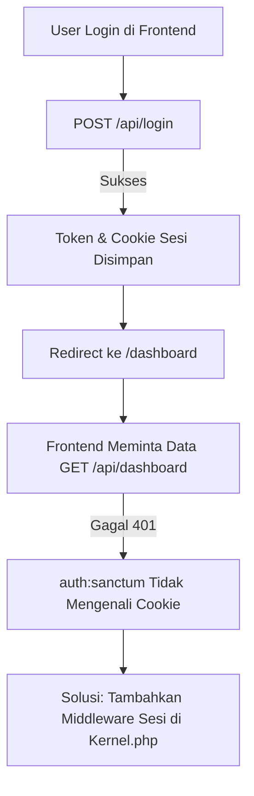

# 📑 Laporan Progres & Catatan Backend & Frontend

⚠️ **Instruksi untuk pengerjaan Selanjutnya**  
- Fokus utama: **selesaikan error 401 Unauthorized** pada request `GET /api/dashboard`.  
- Backend **sudah stabil (99%)**, frontend **baru 50%** dan terblokir oleh isu otentikasi.  
- Solusi yang diduga: Tambahkan middleware pembaca sesi ke grup `api` di `Kernel.php`, lalu bersihkan cache Laravel.  
- Gunakan laporan progres di bawah untuk memahami status proyek sebelum melanjutkan.  

---

**Proyek:** Sistem Monitoring Absensi SMK  
**Tanggal:** 5 September 2025  
**Status Saat Ini:** Backend Stabil ✅, Frontend Terblokir oleh Isu Otentikasi 🚨  

---

## 1. 🎯 Ringkasan Proyek
Sistem monitoring absensi berbasis **lokasi (GPS)** untuk siswa dan guru.  
- **Backend:** Laravel  
- **Frontend:** Vue.js + Inertia.js  

---

## 2. 📊 Tabel Progres

| Komponen   | Status     | Persentase | Keterangan                                                                 |
|------------|-----------|-------------|-----------------------------------------------------------------------------|
| Backend    | ✅ Stabil | 99%         | Migrasi, seeder, API, dan logika bisnis sudah berjalan & teruji.            |
| Frontend   | 🚧 Parsial | 50%         | Struktur dan halaman dasar sudah ada, tapi terblokir error 401.             |
| Database   | ✅ Siap   | 100%        | 22 migrasi sukses, 8 seeder berhasil dengan data dummy fungsional.          |
| API        | ✅ Siap   | 100%        | Endpoint login, absensi, zona, pelanggaran, export Excel sudah teruji.      |
| Live GPS   | ⚡ Fondasi | 80%         | Laravel Reverb (WebSocket) sudah diimplementasi di backend.                 |
| Integrasi  | ❌ Gagal  | 0%          | Terblokir error 401 pada komunikasi frontend-backend.                       |

---

## 3. ✅ Detail Progres Backend
- **Database:** 22 migrasi sukses, tabel lengkap (users, absensi, zona, kelas, dll.)  
- **Seeder:** 8 seeder berhasil, data dummy sesuai semua peran (IT, Guru, BK, Siswa).  
- **API Utama Teruji via Postman:**
  - `POST /api/login` → Autentikasi & token.  
  - `POST /api/absen/siswa` → Absensi dengan validasi lokasi.  
  - `POST /api/absen/guru/masuk` & `/pulang` → Absensi guru.  
  - `POST /api/zona` → Tambah zona baru.  
  - `POST /api/catatan-pelanggaran` → Simpan catatan.  
  - `GET /api/export/absensi/siswa` → Ekspor Excel.  
- **Live GPS:** Fondasi WebSocket sudah siap.  

---

## 4. 🏗️ Detail Progres Frontend
- **Struktur Proyek:** `resources/js` sudah rapi (Components, Layouts, Pages).  
- **Halaman Utama:**
  - `Login.vue` → Login berfungsi.  
  - `AuthenticatedLayout.vue` → Template utama pasca login.  
  - `Dashboard.vue` → Dashboard induk berdasarkan peran.  
  - `Dashboard/*` → Placeholder dashboard untuk Siswa, Guru, BK, IT.  
- **Integrasi Awal:** Login sukses, redirect ke `/dashboard`.  

---

## 5. 🚨 Blocker Kritis: Error 401 Unauthorized
- **Kondisi:** Setelah login, request `GET /api/dashboard` gagal dengan **401 Unauthorized**.  
- **Hasil Debugging:**  
  - Cookie sesi (`sistem-monitoring-smk-session`) terkirim dengan benar.  
  - `.env`, `cors.php`, `sanctum.php` → sudah benar.  
  - **Akar Masalah:** Middleware `api` tidak bisa membaca sesi → `auth:sanctum` gagal mengenali user.  

---

## 6. 🔄 Diagram Alur Request (Login → Dashboard → API)


## 7. 📝 Tugas Programmer Selanjutnya
🔑 Prioritas #1: Perbaiki Error 401
Edit file app/Http/Kernel.php, tambahkan middleware sesi ke grup api:

```php
'api' => [
    // =================================================================
    // TAMBAHKAN DUA BARIS INI UNTUK MEMPERBAIKI ERROR 401
    // =================================================================
    \App\Http\Middleware\EncryptCookies::class,
    \Illuminate\Session\Middleware\StartSession::class,
    // =================================================================

    \Laravel\Sanctum\Http\Middleware\EnsureFrontendRequestsAreStateful::class,
    'throttle:api',
    \Illuminate\Routing\Middleware\SubstituteBindings::class,
],
```
## 🧹 Prioritas #2: Bersihkan Cache Laravel
Setelah perubahan di atas, jalankan:

```bash
php artisan config:clear
php artisan route:clear
php artisan cache:clear
```
(Pastikan semua server dihentikan dulu: php artisan serve, npm run dev, dll.)

## 8. ⚙️ Panduan Instalasi & Setup Lingkungan Development
### A. Prasyarat (Software yang Harus Terinstal)

- PHP 8.2+
- Composer 2+
- Node.js 18+ & NPM
- PostgreSQL
- Git

### B. Setup Backend

1. Clone repositori:
```bash
git clone -b frontend https://github.com/awanmh/PortalSantriCerdas.git
cd projeknya(sesuaikan dengan nama projek)
```
2. Instal dependensi PHP:
```bash
composer install
```

3. Konfigurasi `.env`:
```bash
cp .env.example .env
php artisan key:generate
```

Sesuaikan database:
```.env
DB_CONNECTION=pgsql
DB_HOST=127.0.0.1
DB_PORT=5432
DB_DATABASE=smk_monitoring
DB_USERNAME=postgres
DB_PASSWORD=root
```

4. Migrasi & seeding:
```bash
php artisan migrate:fresh --seed
```

5. Instal Laravel Reverb:
```bash
php artisan reverb:install
```

### C. Setup Frontend

1. Instal dependensi JavaScript:
```bash
npm install
```
2. Generate Ziggy route:
```bash
php artisan ziggy:generate
```

### D. Menjalankan Aplikasi
Buka 3 terminal terpisah:

1. Backend Laravel
```bash
php artisan serve
```
2. WebSocket Reverb
```bash
php artisan reverb:start
```
3. Frontend Vite
```bash
npm run dev
```

Akses aplikasi via URL Vite **(biasanya http://127.0.0.1:5173)**.

## 9. ✅ Checklist To-Do

 - ✅ Backend selesai & stabil (99%)
 - ✅ Migrasi & seeder sukses
 - ✅ API utama teruji dengan Postman
 - ⬛ Perbaiki error 401 dengan update Kernel.php
 - ⬛ Bersihkan cache Laravel setelah perubahan
 - ⬛ Lanjutkan pengembangan frontend setelah error 401 teratasi
